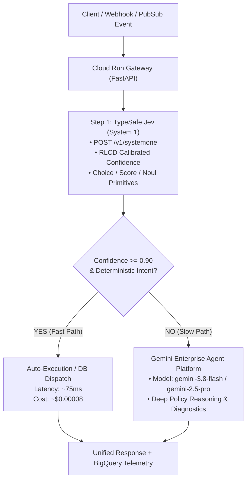

# Hybrid AI Architecture on Google Cloud: Sub-100ms Gateway with TypeSafe Jev & Gemini Enterprise Agent Platform

[](https://cloud.google.com/run)
[](https://cloud.google.com)
[](https://typesafe.ai)
[](LICENSE)

A production-ready reference architecture and step-by-step tutorial series combining **TypeSafe AI's Jev** (fast, typed, calibrated System 1 reflexes via `https://api.typesafe.ai/v1/systemone`) and **Google Cloud's Gemini Enterprise Agent Platform** (`gemini-3.8-flash` / `gemini-2.5-pro` via the `google-genai` SDK for deep System 2 generative reasoning) into an ultra-low latency, cost-optimized AI Gateway on **Cloud Run**.

---

## 🌟 The Core Problem & Solution

| Challenge with Pure LLMs | Hybrid Gateway Solution |
| :--- | :--- |
| **High Latency:** Calling Gemini/GPT for every triage decision introduces 1,500–5,000ms delay. | **Sub-100ms Reflexes:** Jev classifies incoming events and calculates confidence in **~50–90ms**. |
| **High Cost:** Running million-token workloads on frontier LLMs is cost-prohibitive. | **400x Cheaper:** Jev costs **\$0.042 / MTok** with zero output token fees; Gemini is only called when needed. |
| **Hallucinated Schemas:** LLMs occasionally output broken JSON or invalid enum fields. | **Mathematically Zero Type Errors:** Jev uses constrained parallel heads (`choice`, `score`, `noul`) with guaranteed typing. |
| **Overconfidence:** LLMs hallucinate high certainty on edge cases. | **Calibrated Uncertainty (RLCD):** If confidence is `< 0.90`, the system automatically escalates to Gemini (`gemini-3.8-flash` / `gemini-2.5-pro`). |

---

## 📐 Architecture Overview



---

## 📂 Repository Layout

```
.
├── 01-basic-classifier/
│   ├── main.py               # Stage 01: Standalone Jev Classifier on Cloud Run
│   ├── Dockerfile            # Lean container for Stage 01
│   ├── deploy.sh             # Cloud Run deployment script with Secret Manager
│   ├── requirements.txt      # Stage 01 dependencies (including typesafe-sdk)
│   ├── README.md             # Stage 01 instructions
│   └── RESULTS.md            # Cloud Run verification verdicts
├── app/
│   ├── config.py             # Pydantic Settings & environment config
│   ├── models.py             # Strict Pydantic contracts & Enums
│   ├── jev_client.py         # Live TypeSafe Jev (/v1/systemone) client
│   ├── gemini_client.py      # Live Gemini Enterprise Agent Platform (google-genai) client
│   ├── router.py             # Hybrid confidence-based router
│   ├── main.py               # FastAPI server & endpoints (/health, /api/v1/triage)
│   └── static/
│       └── index.html        # Interactive developer dashboard & latency waterfall
├── scripts/
│   ├── quickstart_jev.py     # Standalone Python script to call Jev directly
│   ├── setup_gcp.sh          # Idempotent GCP setup (APIs, IAM, Secrets, BigQuery)
│   ├── deploy.sh             # Cloud Run build and deploy script
│   └── test_queries.py       # Automated benchmark test suite
├── sql/
│   └── bigquery_schema.sql   # BigQuery metrics table definition
├── blog-series-part1-intro.html # Part 1 Blog Post (HTML)
├── Dockerfile                # Production non-root container for Cloud Run
├── docker-compose.yml        # 1-click local Docker setup
├── requirements.txt          # Python dependencies (google-genai, typesafe-sdk, fastapi)
├── .env.example              # Template environment variables
├── README.md                 # Project landing page
└── TUTORIAL.md               # Complete step-by-step tutorial guide
```

---

## ⚡ Direct Jev Quickstart (Python)

To call TypeSafe Jev (`https://api.typesafe.ai/v1/systemone`) directly from Python without launching the full gateway:
```bash
export TYPESAFE_API_KEY="your_typesafe_api_key"

python3 scripts/quickstart_jev.py "Where is my package #8942? Has it shipped yet?"
```

---

## 🚀 Quickstart: Running the Full Hybrid Gateway Locally

### 1. Clone & Configure
```bash
cp .env.example .env
# Edit .env and set your TYPESAFE_API_KEY and GOOGLE_CLOUD_PROJECT
```

### 2. Run with Docker Compose
```bash
docker compose up --build
```

### 3. Open the Interactive Dashboard
Navigate to `http://localhost:8080` in your browser. You can click any of the preset enterprise test queries to inspect:
* Real-time **Latency Waterfall** (System 1 vs. System 2)
* Live **Cost Counter**
* **Calibrated Confidence Gauge**
* Dispatched automated resolution payload

---

## ☁️ Deploying to Google Cloud Run

### 1. Authenticate & Setup GCP
```bash
gcloud auth login
gcloud auth application-default login

# Run the automated setup script (enables APIs, creates Secret Manager secret, IAM roles, BigQuery)
./scripts/setup_gcp.sh <YOUR_PROJECT_ID> us-central1 <YOUR_TYPESAFE_API_KEY>
```

### 2. Deploy to Cloud Run
```bash
# Deploy Stage 01 Standalone Classifier
./01-basic-classifier/deploy.sh <YOUR_PROJECT_ID> us-central1

# Deploy Stage 02 Hybrid AI Gateway
./scripts/deploy.sh <YOUR_PROJECT_ID> us-central1
```

---

## 📖 In-Depth Guide

For the full architectural narrative, code explanations, and security hardening details, see **[TUTORIAL.md](TUTORIAL.md)** and **[blog-series-part1-intro.html](blog-series-part1-intro.html)**.
